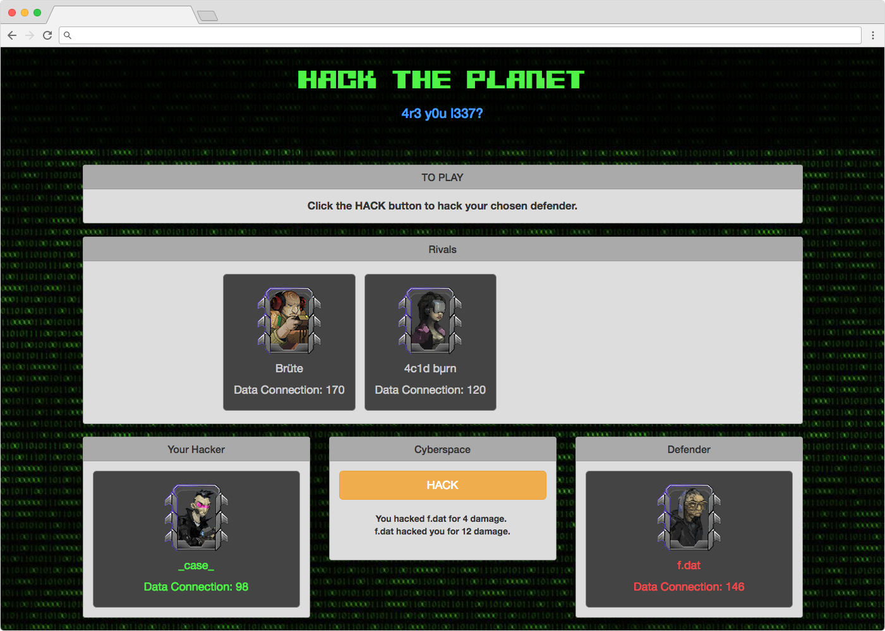

## Concept
Hack the Planet uses constructors to create the available characters and prototypes for functions that are used to interact between each character. When your character attacks a rival, they will counterattack. Your hacking power becomes progressively better with each hack so you must strategically choose your rival targets to come out on top.

<figure>
	
	<figcaption><a href="https://hack-the-planet.herokuapp.com/" title="Travel Aegis Dashboard">Hack the Planet — Game in progress</a></figcaption>
</figure>

## Technologies
Hack the Planet is a fairly simple RPG game that emplys the use of JavaScript and jQuery with Bootstrap and Custom CSS for styling.

## Future development
* Code refactoring -- switch cases and overall code optimization.
* User login and scores
  * Allow users to create an account
  * Multiplayer functionality
  * Score tracking
* More dynamic hacking
  * Hacking arsenal (injection, virus, overload, etc.)
  * Purchase upgrades
* More hacker options
* Customizable hackers once logged in

## Codebase
Check out the code on [GitHub](https://github.com/neurohacked/hack-the-planet)

## Live

Hack the Planet is available at [hack-the-planet.herokuapp.com](https://hack-the-planet.herokuapp.com)
