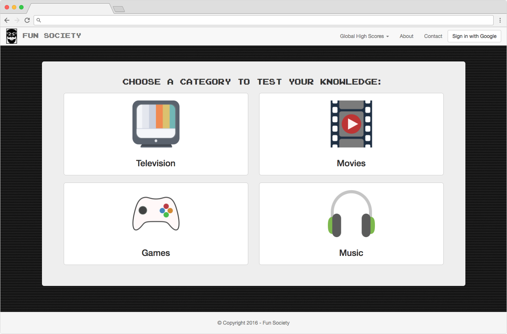
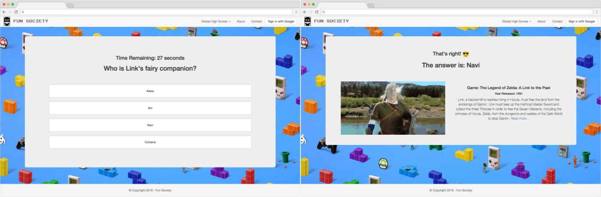

## Concept
Fun Society was created as an escape from the everyday world. An oasis where you can enjoy the diversions in life. Spend a few moments out of your busy day and test your pop-culture knowledge.

<figure>
	
	<figcaption><a href="http://funsociety.club" title="Travel Aegis Dashboard">Fun Society Quiz Selection</a></figcaption>
</figure>

## Design
With an easy to use and familiar design in mind, Fun Society employs the use of:

* Bootstrap CSS & Custom CSS
* Font Awesome
* Fully responsive and mobile friendly.
* Simple and easy to use interface
* Large graphics and buttons for accessibility.
* User sign in for score tracking

<figure>
	
	<figcaption><a href="http://funsociety.club" title="Travel Aegis Dashboard">Fun Society Question & Answer Pages (Games Category)</a></figcaption>
</figure>

## Technologies
Fun Society uses [Firebase](https://firebase.google.com) to manage user accounts/scores and APIs to display info related to the trivia questions.

#### APIs Used

* [GIPHY](https://api.giphy.com)
* [OMDB](https://www.omdbapi.com)
* [IGDB](https://www.igdb.com/api)
* [Spotify](https://developer.spotify.com/web-api/)
* [Discogs](https://www.discogs.com/developers/)

## Future Development
* Fix general errors.
 * Display issues when switching to games.
 * Cleanup UI.
* Broader game selection — Games based on logic and skill.
* More dynamic score tracking, also based on skill.
* Different levels of difficulty.
* Integrate multiple user authentication methods through Firebase.
* Monetize the game with upgrades.
  * More Questions.
  * Different categories.

## Live

Fun Society is available at [www.funsociety.club](http://www.funsociety.club)
