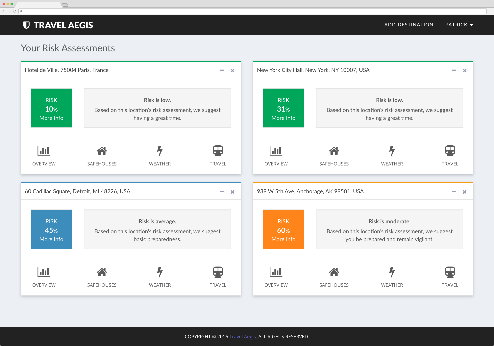

## Concept
In the age of a growing global economy, world travel has never been more imperative. But with increased travel comes increased risk, threatening the safety of even the most seasoned globetrotter. Travel Aegis aims to aide you with this problem using our services designed specifically with your safety in mind. We've scoured various dependable sources to aggregate the most definitive, verifiable and up-to-date data to support visualizing your risk long before you pack your bag.

<figure>
	
	<figcaption><a href="http://travelaegis.com" title="Travel Aegis Dashboard">Travel Aegis Dashboard</a></figcaption>
</figure>

## Design
With a simple and accessible design in mind, Travel Aegis employs the use of:

* Bootstrap CSS & Custom CSS
* Font Awesome
* Owl Carousel
* Morris Charts
* Modernizer

## Technologies

Travel Aegis uses the following technologies under the hood:

* JavaScript & jQuery
* Moment JS
* Bootstrap JS
* MySQL
	* Various Data
* NodeJS
	* 20+ Node modules
* API
	* Google Places
	* DarkSky

## Live

Travel Aegis is available at [www.travelaegis.com](http://travelaegis.com)
